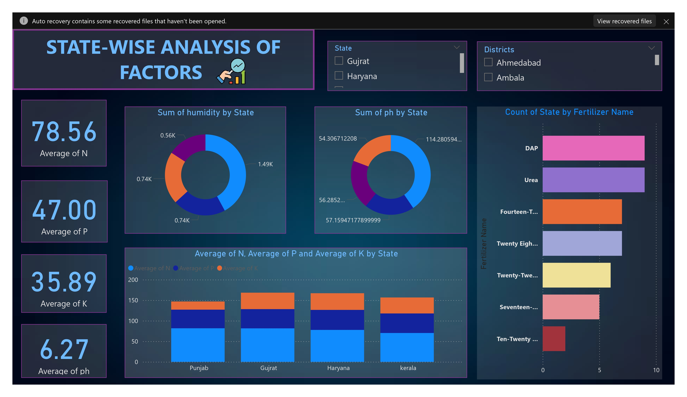

# 🌱 State-Wise Nutrient Analysis Dashboard 📊

## 📌 Overview

This Power BI project focuses on the **state-wise analysis of soil nutrients** — Nitrogen (N), Phosphorus (P), Potassium (K), and pH levels — across different regions. It helps stakeholders make data-driven decisions for fertilizer planning and soil health management.

---

## 🎯 Project Aim

> To develop an interactive dashboard that **visualizes soil nutrient distribution** and **analyzes fertilizer usage** across different states and districts, supporting **optimized agricultural practices**.

---

## ⚙️ How It Works

1. 📥 Imported soil nutrient data into Power BI Desktop.
2. 📈 Created dynamic visualizations for:
   - Average N, P, K, and pH levels by State.
   - Humidity and pH distribution across States.
   - Fertilizer distribution by State and Fertilizer Name.
3. 🎛️ Added slicers to filter results by **State** and **District** for detailed regional analysis.

---

## 🔑 Key Features

| Feature | Description |
|--------|-------------|
| 🧪 **Nutrient Analysis** | Average values of N, P, K, and pH levels by region. |
| 🌦️ **Humidity and pH Distribution** | Visualize environmental factors influencing soil health. |
| 🧴 **Fertilizer Usage Insights** | Compare fertilizer application patterns across states. |
| 🎯 **Interactive Filters** | Filter data based on State and District selection. |
| 🗺️ **Regional Comparison** | Understand soil and fertilizer dynamics state-wise. |

---

## 📋 Project Insights

- **Nutrient Averages**: Punjab, Gujarat, Haryana, and Kerala showed varying nutrient levels, highlighting the need for state-specific fertilizer recommendations.
- **Top Fertilizers Used**: DAP and Urea are the most widely used fertilizers across analyzed states.
- **Soil pH Variation**: Significant pH differences observed between states, impacting fertilizer selection.
- **Humidity Factors**: Variations in humidity levels correlate with nutrient retention and soil quality.
- **Actionable Insight**: Tailoring fertilizer plans based on nutrient deficiencies can significantly improve crop productivity.

---

## ❓ Key Business Questions Addressed

- What is the average soil nutrient profile across different states?
- Which fertilizers are predominantly used, and where?
- How do environmental factors like humidity and pH vary regionally?
- Which regions need more targeted nutrient management strategies?

---

## 📸 Dashboard Snapshot

### 🌾 State-Wise Analysis of Soil Factors

---

## 🙋‍♀️ Created By

**Rashi** — Passionate about data-driven agricultural solutions 🌿📈

---

> _"Healthy soil, better yield — powered by smart data analysis!"_ 🌎✨
